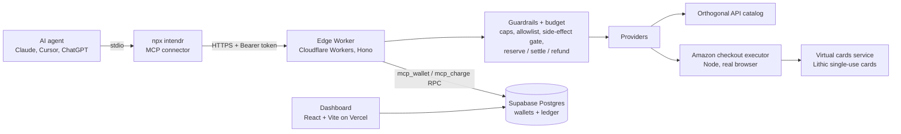

# intendr

**A spend-capped wallet any AI agent can pay with, over MCP.** Add one connector to Claude,
Cursor or ChatGPT desktop and the agent gets a wallet with a hard budget and a catalog of
paid capabilities. It stops itself the moment a purchase would break the cap.

Built at the Ramp Hackathon. Dashboard: **[intendr-edge.vercel.app](https://intendr-edge.vercel.app)**

## The problem

Agents can increasingly do things that cost money, and there is no safe, portable way to
give one a budget. Handing an agent your card is reckless. Wiring payments and limits into
every chatbot separately is toil. intendr is one MCP endpoint that provides:

1. **A wallet with caps.** Balance, global cap, per-category caps and a merchant allowlist.
2. **A catalog of paid capabilities.** The Orthogonal data API catalog (company enrichment,
   people search, email verification, funding, news) plus commerce providers.
3. **Governance on every call.** Reserve, run, then settle or refund. Real-world actions
   always stop for the user's approval, and raising the cap can never approve one silently.

## Connect it

```bash
claude mcp add intendr -- npx -y intendr
```

Any other MCP client takes the same stdio server:

```json
{ "mcpServers": { "intendr": { "command": "npx", "args": ["-y", "intendr"] } } }
```

On first run the connector opens a browser to sign in (a device-code flow, so nothing
listens on a local port). After that the agent spends against your own wallet. The
Orthogonal key stays on the server; you never handle one.

## MCP tools

| Tool | What it does |
| --- | --- |
| `search_services` | Find paid capabilities by natural language |
| `get_service` | Price, side effect and input schema for one capability |
| `pay_and_run` | Pay for and run a capability under the wallet's spend controls |
| `get_wallet` / `get_spend_summary` | Balance, caps, spent, overspend blocked, remaining |
| `approve` | Approve, raise a cap, or skip a gated payment |

## Architecture



- **The charge is one atomic statement.** `mcp_charge` debits the balance and writes the
  ledger row in a single Postgres update, so concurrent calls cannot overspend and every
  purchase shows up in the dashboard.
- **Card numbers never reach the model or the edge.** The edge handles a one-time token;
  the checkout executor redeems the card server-side, uses it once, and the single-use card
  closes itself.
- **One contract for every provider.** Each provider implements `search`, `details` and
  `run`, so a data API and a real-world purchase go through the same budget path.

## Repository layout

```
apps/
  edge/            Cloudflare Worker: MCP endpoint, device-code login, wallet RPCs
  mcp/             the npx connector (stdio MCP server proxying to the edge)
  web/             wallet dashboard: auth, wallet, cards, transactions (Supabase)
  landing/         marketing site (Astro)
  virtual-cards/   Lithic single-use card issuance for approved purchases
  amazon-agent/    Node service that drives Amazon checkout in a real browser
packages/
  contracts/       shared interfaces and types
  budget/          reserve, settle and refund engine
  guardrails/      global and category caps, merchant allowlist, side-effect gate
  providers/       Orthogonal, Amazon, Uber, DoorDash providers
  commerce/        card issuers, location, Amazon client
  wallet/ mcp/ harness/ db/ ui/
test/mcp-smoke/    research on third-party commerce MCP servers
docs/              PLAN.md (product) and MONOREPO.md (repo shape and hosting)
```

## Tech stack

TypeScript, Bun workspaces, Turborepo · Cloudflare Workers, Hono ·
Model Context Protocol SDK, Zod · Supabase (Postgres, auth) · React, Vite, React Router ·
Astro · Express, Lithic, Pino · Vitest

## Run it locally

Requires [Bun](https://bun.sh) 1.3.

```bash
bun install
bun run typecheck                 # tsc across every workspace
bun run dev                       # landing, dashboard and edge Worker together

bun run --cwd apps/edge dev       # just the Worker, http://localhost:8787
bun run --cwd apps/web dev        # just the dashboard
bun run --cwd apps/landing dev    # just the marketing site
bun run --cwd apps/virtual-cards test
```

Put per-app flags after `run` (`bun run --cwd apps/web build`); on Bun 1.3 the
`bun --cwd apps/web run build` form prints Bun's help instead.

**Configuration.**

- The dashboard needs Supabase: copy `apps/web/.env.example` to `apps/web/.env.local` and
  set `VITE_SUPABASE_URL` and `VITE_SUPABASE_ANON_KEY`. Schema and RPCs are in
  `apps/web/supabase/` (`schema.sql`, then `002_cards.sql`, then `003_mcp_rpcs.sql`). Full
  steps: [docs/MONOREPO.md](docs/MONOREPO.md#running-appsweb-locally).
- The Worker reads `ORTHOGONAL_API_KEY`, `SUPABASE_URL`, `SUPABASE_SERVICE_KEY` and
  `SUPABASE_ANON_KEY` as Wrangler secrets; see `apps/edge/.dev.vars.example`.
- The virtual-cards service defaults to demo mode; see
  [apps/virtual-cards/README.md](apps/virtual-cards/README.md).
- Point the connector at a local Worker with `INTENDR_URL=http://localhost:8787`.

## Status

Hackathon build.

| Piece | State |
| --- | --- |
| MCP connector, device-code sign-in | Working, published to npm as `intendr` |
| Edge Worker and Supabase wallet with atomic charge | Working, deployed on Cloudflare |
| Orthogonal data catalog | Real paid API calls |
| Guardrails, budget, approval gate | Working |
| Dashboard | Working, deployed on Vercel |
| Amazon purchase | Mock by default; real browser checkout behind `AMAZON_LIVE=1` (needs patchright) |
| Virtual cards | Demo mode by default; Lithic sandbox issuance path included |
| Uber, DoorDash | Mock providers behind the real provider interface |

Funding rails beyond the prepaid wallet (Ramp card, x402) are interface stubs.

## Team

Built at the Ramp Hackathon by Abdullah Al Mahmud ([@zero-abd](https://github.com/zero-abd)),
Phong Nguyen ([@phongtnguyen2006](https://github.com/phongtnguyen2006)) and Sathvik
Lakamsani ([@SathvikLakamsani](https://github.com/SathvikLakamsani)).

## Contributor tooling

Contributors who use Claude Code can install the project-local ECC agent harness; see
[SKILLS_SETUP.md](SKILLS_SETUP.md). It is gitignored and not needed to build or run intendr.
